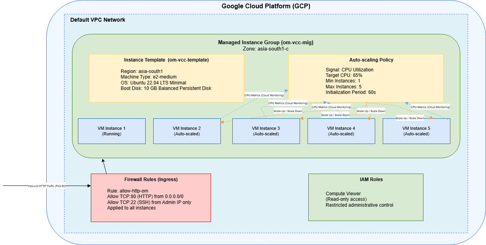

# VCC Assignment 2 - Auto Scaling on GCP

This repository contains configuration scripts used for Assignment 2
of the Virtualization and Cloud Computing course.

## Contents
- Startup script for VM instance
- Architecture diagram
- Assignment documentation
- Demo (link present in the documentation)
## Architecture Diagram

## Cloud Platform
Google Cloud Platform (GCP)

## Features Implemented
- Managed Instance Group
- CPU-based Auto Scaling
- IAM restricted access
- Firewall security rules